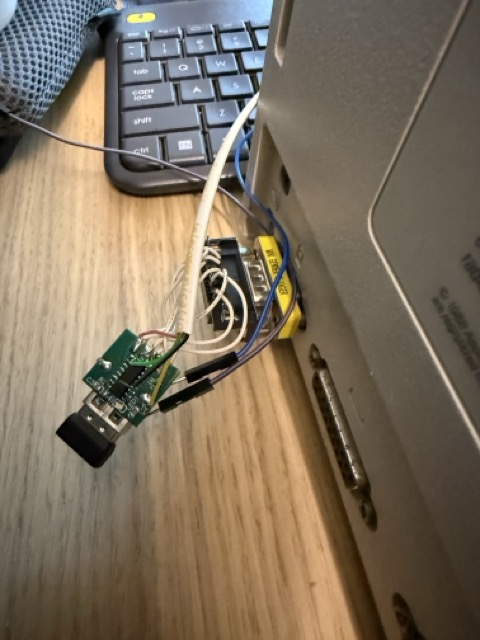
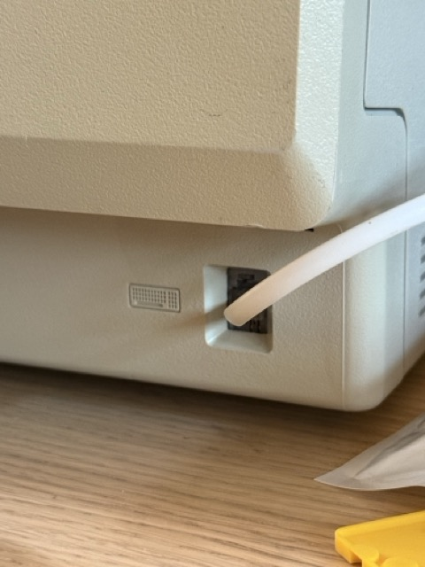

# Macintosh Plus USB Keyboard and Mouse Adapter

Firmware for a CH554-based USB host adapter that lets a Macintosh Plus, 512K, or 128K use a modern USB HID keyboard and mouse.

The adapter enumerates a USB HID boot keyboard and/or boot mouse, translates keyboard reports to Macintosh keyboard protocol transitions, and converts USB mouse movement to Macintosh quadrature mouse signals.

## Current Status

This project is at working-prototype stage. A PCB is still TODO.




## Supported Devices

- USB HID boot-protocol keyboards.
- USB HID boot-protocol mice.
- Composite keyboard/mouse receivers, such as many 2.4 GHz wireless dongles.
- A keyboard-only or mouse-only device.

The CH554 firmware handles one USB device on the root host port. If the keyboard and mouse are separate USB devices, use a combined receiver or build two adapters.

## Hardware Notes

The firmware targets a WCH CH554 running at 16 MHz.

Configured signal pins:

| DB9 pin| CH554 pin | Function |
| --- | --- | --- |
| N/A | P3.3 | Macintosh keyboard DATA |
| N/A | P3.4 | Macintosh keyboard CLOCK |
| 4 | P1.4 | Mouse X1 quadrature |
| 5 | P1.1 | Mouse X0 quadrature |
| 9 | P1.6 | Mouse Y0 quadrature |
| 8 | P1.7 | Mouse Y1 quadrature |
| 7 | P1.5 | Mouse button |
| N/A | P3.2 | USB/device status LED, active low |
| N/A | P3.1 | Optional UART0 TX debug output |
| N/A | P3.0 | Optional UART0 RX debug output |

Debug serial, when enabled, is UART0 TX on P3.1 at 9600 8N1.

## Building

Install PlatformIO, then install the project Python dependency into PlatformIO's Python environment.
On macOS or Linux:

```sh
~/.platformio/penv/bin/python -m pip install -r requirements-pio.txt
```

On Windows:

```powershell
& "$env:USERPROFILE\.platformio\penv\Scripts\python.exe" -m pip install -r requirements-pio.txt
```

Build the firmware:

```sh
pio run
```

## Flashing

The default upload command converts the Intel HEX output to `firmware.bin`, then flashes it with `ch55xtool.py`:

```sh
pio run -t upload
```

`ch55xtool.py` requires PyUSB and a native libusb backend. Both are provided by
the packages listed in `requirements-pio.txt`.

An alternate `wchisptool` upload command is kept in `platformio.ini` as a commented reference.

## Debug Logging

Serial debug logging is disabled by default:

```ini
-DDEBUG_SERIAL=0
```

To enable logs on UART0 TX P3.1 at 9600 8N1, change the build flag in `platformio.ini`:

```ini
-DDEBUG_SERIAL=1
```

## Credits

This project is inspired by [jjmz/Atari-Quadrature-USB-Mouse-Adapter](https://github.com/jjmz/Atari-Quadrature-USB-Mouse-Adapter). The mouse quadrature code and early CH554 programming references were derived from that project.

The USB host code is based on WCH CH554 examples, adapted for this adapter.
